# 🪵 Cờ Caro Trực Tuyến

## 1. Giới thiệu


**Cờ Caro Trực Tuyến** là ứng dụng trò chơi cờ Caro được xây dựng bằng Python và Streamlit.

Dự án cho phép người chơi đăng ký, đăng nhập, chơi với máy hoặc chơi trực tuyến với người chơi khác thông qua phòng chơi.

Dự án được thực hiện nhằm áp dụng kiến thức lập trình Python, xây dựng giao diện web, quản lý cơ sở dữ liệu và thuật toán trí tuệ nhân tạo vào một sản phẩm thực tế.


## 2. Mục tiêu của dự án

- Xây dựng trò chơi cờ Caro có giao diện trực quan.
- Cho phép người chơi đăng ký và đăng nhập tài khoản.
- Hỗ trợ chơi với máy.
- Hỗ trợ chơi trực tuyến giữa hai người chơi.
- Quản lý phòng chơi trực tuyến.
- Lưu thông tin người chơi và lịch sử trận đấu.
- Xây dựng hệ thống xếp hạng ELO.
- Quản lý dữ liệu bằng SQLite.
- Áp dụng thuật toán trí tuệ nhân tạo cho chế độ chơi với máy.

## 3. Chức năng chính

### 3.1. Đăng ký tài khoản

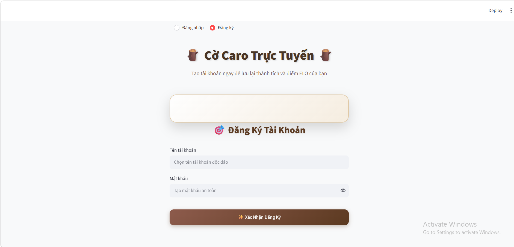

Người chơi có thể tạo tài khoản mới bằng cách nhập thông tin đăng ký.

### 3.2. Đăng nhập


Người chơi đăng nhập bằng tài khoản đã đăng ký để sử dụng hệ thống.

### 3.3. Chơi với máy

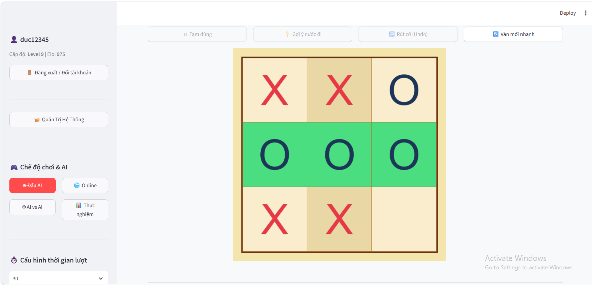

Người chơi có thể thi đấu với máy.

Hệ thống sử dụng thuật toán tìm kiếm để lựa chọn nước đi phù hợp cho máy.

### 3.4. Chơi trực tuyến

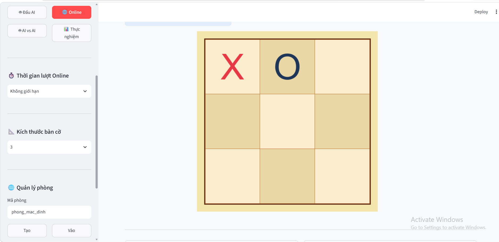

Người chơi có thể tạo hoặc tham gia phòng chơi trực tuyến.

Trạng thái phòng và bàn cờ được đồng bộ thông qua cơ sở dữ liệu.

### 3.5. Quản lý phòng

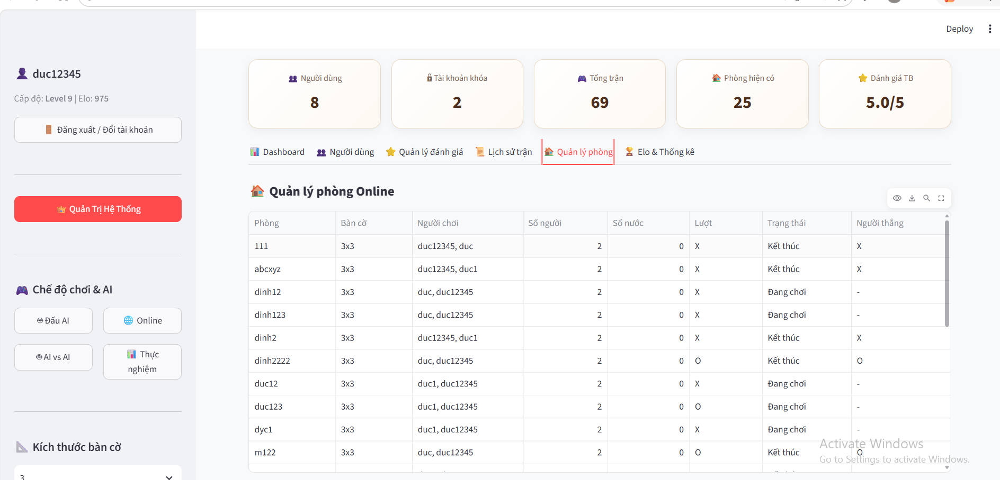

Hệ thống hỗ trợ:

- Tạo phòng.
- Tham gia phòng.
- Quản lý người chơi trong phòng.
- Theo dõi trạng thái trận đấu.
- Bắt đầu ván mới.

### 3.6. Xếp hạng ELO

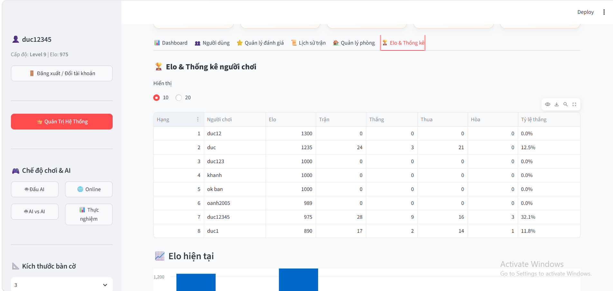

Hệ thống sử dụng điểm ELO để cập nhật thứ hạng của người chơi sau trận đấu.

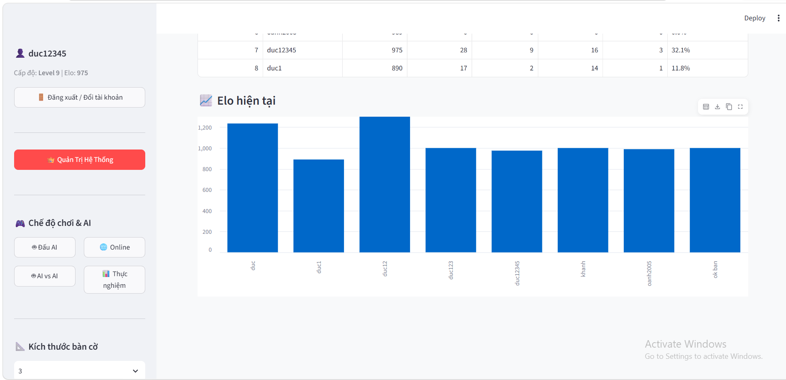

Điểm ELO được cập nhật dựa trên kết quả thắng, thua hoặc hòa.

## 4. Công nghệ sử dụng

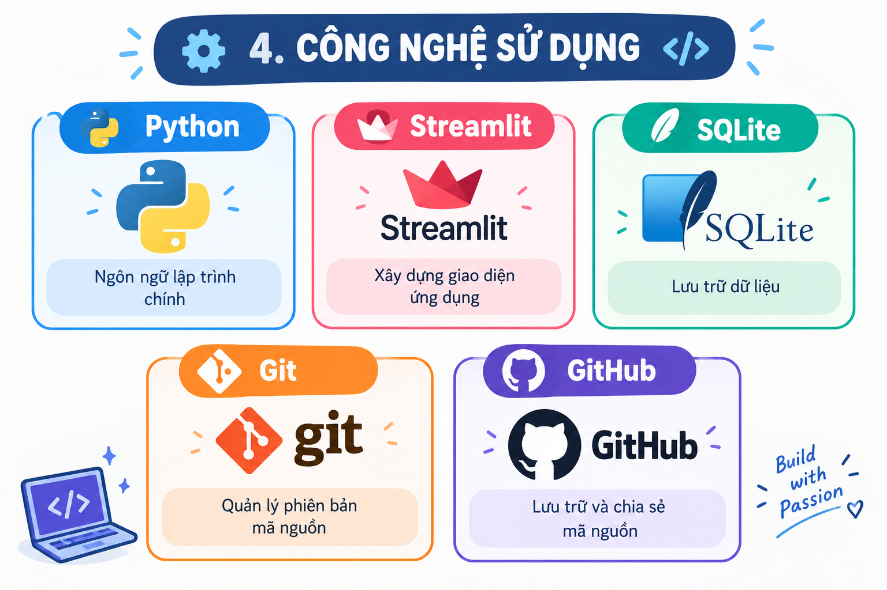

| Công nghệ | Mục đích |
|---|---|
| Python | Ngôn ngữ lập trình chính |
| Streamlit | Xây dựng giao diện ứng dụng |
| SQLite | Lưu trữ dữ liệu |
| Git | Quản lý phiên bản mã nguồn |
| GitHub | Lưu trữ và chia sẻ mã nguồn |

## 5. Thuật toán

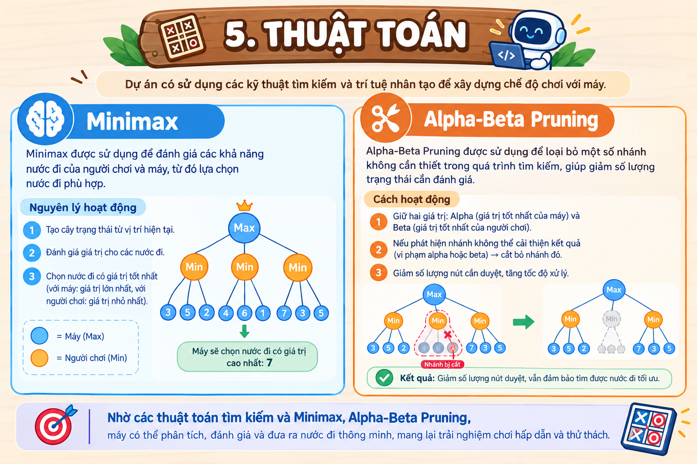

Dự án có sử dụng các kỹ thuật tìm kiếm và trí tuệ nhân tạo để xây dựng chế độ chơi với máy.

### Minimax

Minimax được sử dụng để đánh giá các khả năng nước đi của người chơi và máy, từ đó lựa chọn nước đi phù hợp.

### Alpha-Beta Pruning

Alpha-Beta Pruning được sử dụng để loại bỏ một số nhánh không cần thiết trong quá trình tìm kiếm, giúp giảm số lượng trạng thái cần đánh giá.

## 6. Cơ sở dữ liệu

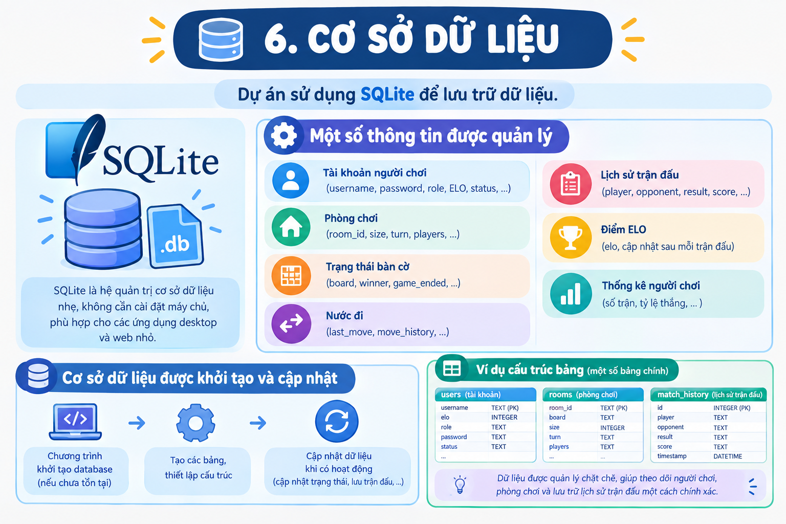

Dự án sử dụng SQLite để lưu trữ dữ liệu.

Một số thông tin được quản lý gồm:

- Tài khoản người chơi.
- Phòng chơi.
- Trạng thái bàn cờ.
- Nước đi.
- Lịch sử trận đấu.
- Điểm ELO.
- Thống kê người chơi.

Cơ sở dữ liệu được khởi tạo và cập nhật thông qua chương trình.

## 7. Cấu trúc dự án

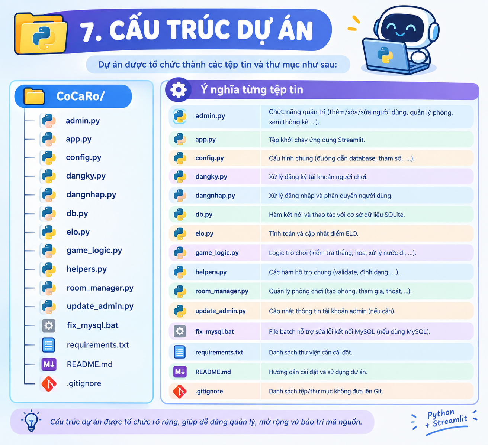

```text
CoCaRo/
│
├── admin.py
├── app.py
├── config.py
├── dangky.py
├── dangnhap.py
├── db.py
├── elo.py
├── game_logic.py
├── helpers.py
├── room_manager.py
├── update_admin.py
├── fix_mysql.bat
├── requirements.txt
├── README.md
└── .gitignore

## 8. Hướng dẫn cài đặt và chạy chương trình

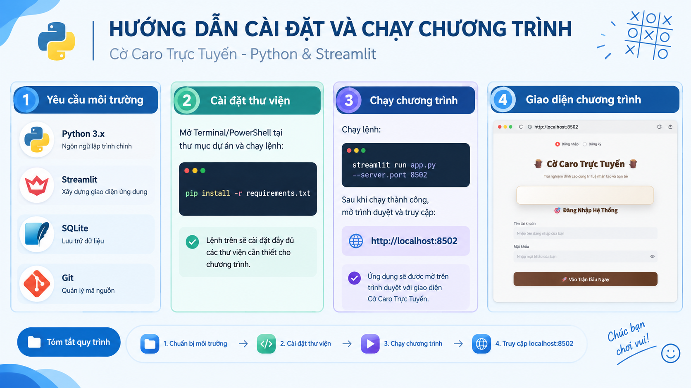

### 8.1. Yêu cầu môi trường

- Python 3.x
- Streamlit
- SQLite
- Git

### 8.2. Cài đặt thư viện

Mở Terminal/PowerShell tại thư mục dự án:

```bash
pip install -r requirements.txt
```

### 8.3. Chạy chương trình

```bash
streamlit run app.py --server.port 8502
```

Sau khi chạy thành công, mở:

```text
http://localhost:8502
```